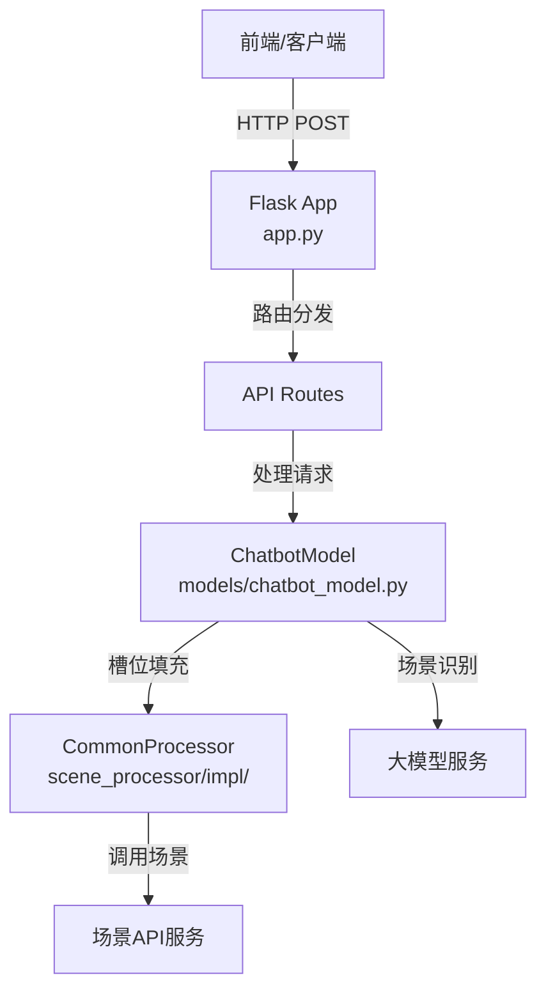
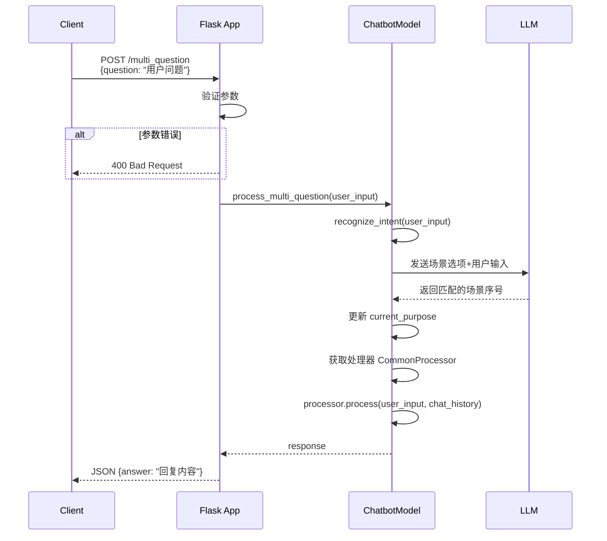
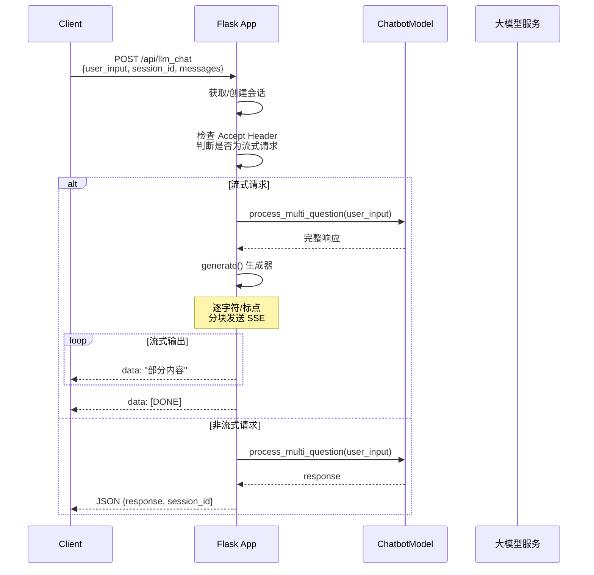
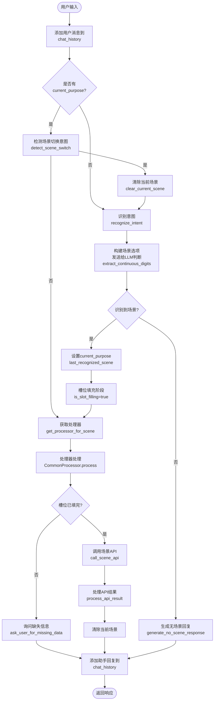
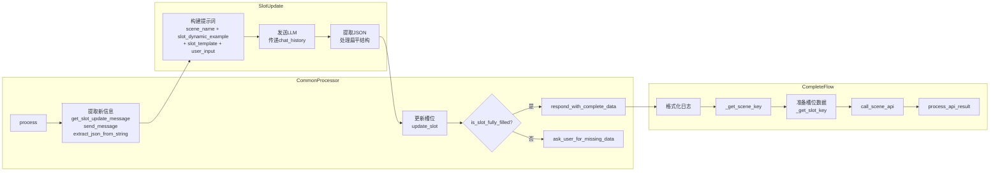
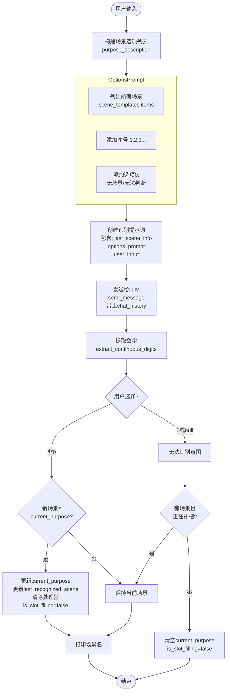
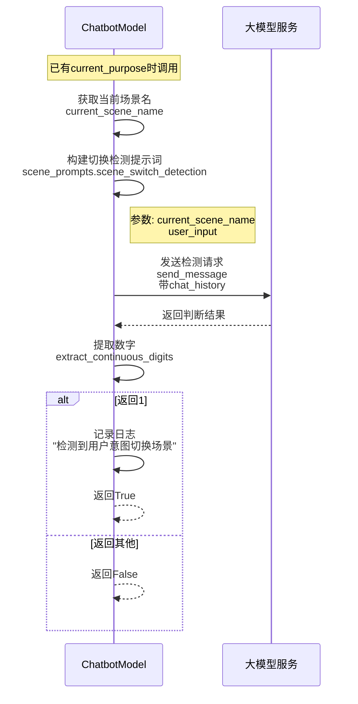
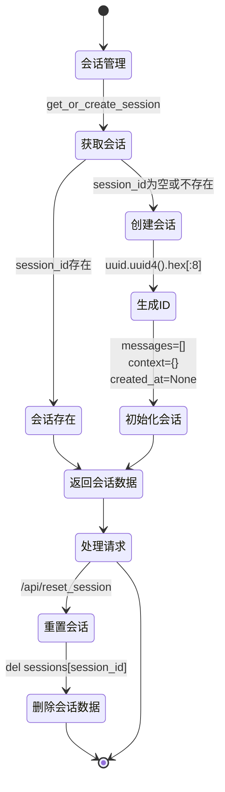
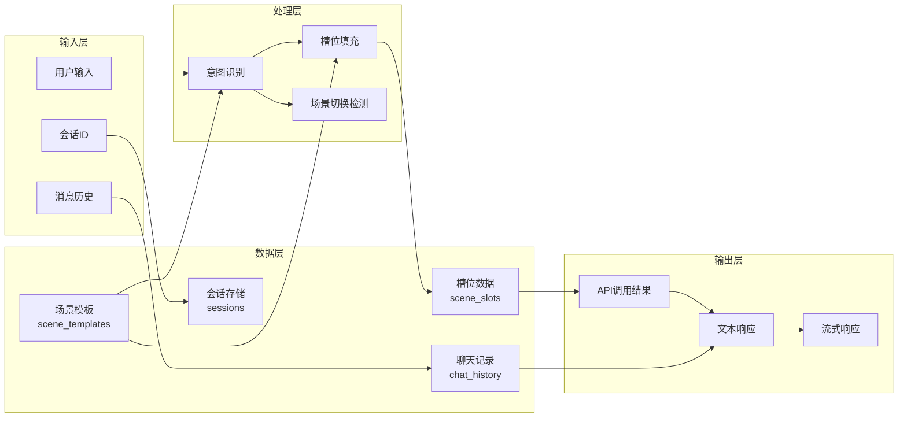
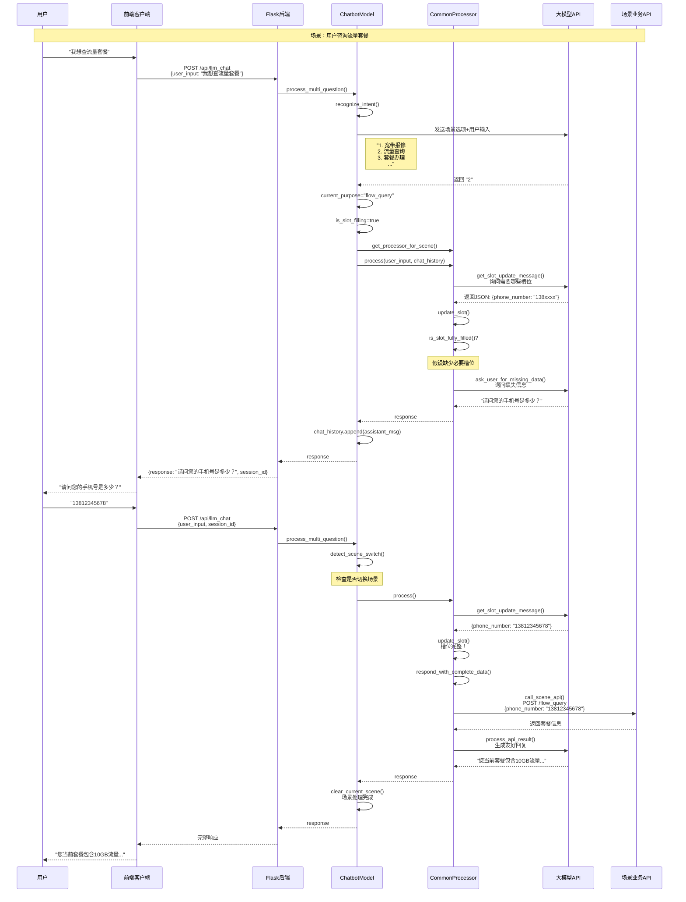

# IntelliQ 业务流程图

## 1. 系统架构概览



## 2. API接口流程

### 2.1 `/multi_question` 接口流程



### 2.2 `/api/llm_chat` 流式接口流程



## 3. 核心业务处理流程

### 3.1 多轮对话处理主流程



### 3.2 槽位填充详细流程



## 4. 意图识别流程



## 5. 场景切换检测流程



## 6. 会话管理流程



## 7. 数据流图



## 8. 错误处理流程

```mermaid
flowchart TD
    Start([请求开始]) --> Validate[参数验证]
    
    Validate --> Error{参数错误?}
    Error -->|是| Return400[返回 400 Bad Request<br/>{error: "描述"}]
    
    Error -->|否| Process[业务处理]
    
    Process --> Exception{发生异常?}
    Exception -->|是| LogError[记录错误日志<br/>logging.error]
    Exception -->|否| Success[返回成功响应]
    
    LogError --> IsStream{流式请求?}
    IsStream -->|是| StreamError[返回SSE错误<br/>data: [ERROR] message]
    IsStream -->|否| Return500[返回 500 Internal Server Error]
    
    Return400 --> End([结束])
    Success --> End
    StreamError --> End
    Return500 --> End
```

## 9. 完整的聊天处理时序图



---

## 文件结构说明

| 文件路径 | 职责 |
|---------|------|
| `app.py` | Flask应用入口，定义API路由，处理HTTP请求/响应，管理会话 |
| `app_config.py` | 配置类，管理环境变量、API前缀、CORS等 |
| `models/chatbot_model.py` | 核心业务逻辑，意图识别、场景切换检测、流程控制 |
| `scene_processor/scene_processor.py` | 场景处理器抽象基类 |
| `scene_processor/impl/common_processor.py` | 通用场景处理器实现，槽位填充逻辑 |
| `utils/helpers.py` | 工具函数：加载配置、调用API、槽位操作等 |
| `scene_config/scene_templates.json` | 场景配置模板 |
| `scene_config/scene_prompts.py` | 场景相关的提示词模板 |
